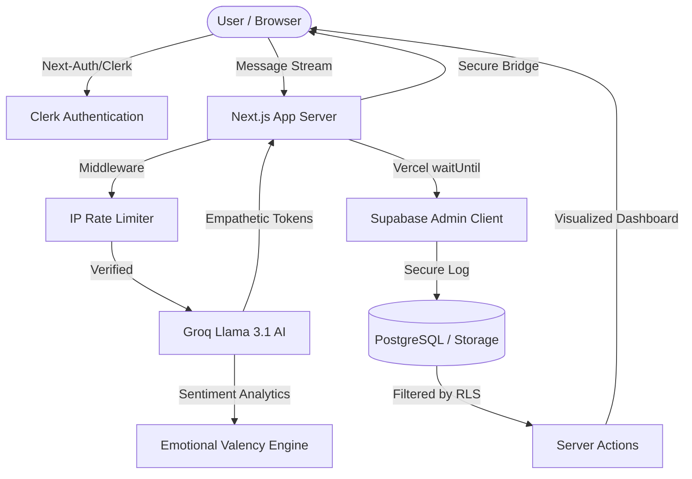

<p align="center">
  
  
  
  
  
  
</p>

# Hapiimood 🧠💜
### *The Digital Sanctuary for Student Mental Wellness*

Hapiimood is a **Production-Ready AI Mental Wellness Ecosystem** designed to provide 100% anonymous, immediate, and empathetic support for students. In an era of high-pressure academics, Hapiimood bridges the gap between distress and professional care using state-of-the-art Natural Language Processing.

## 📊 System Architecture & Data Flow



---

## 🌟 Core Features & USP
- **Hapi (AI Companion):** Real-time, zero-latency empathetic chat powered by **Groq Llama-3.1** models natively integrated with `@ai-sdk/react`.
- **Background Sentiment Analysis:** Evaluates every message continuously to formulate an autonomous Emotional Valency score.
- **Deep Analytics Dashboard:** A personalized `Recharts` based visualization hub. Tracks Mood Trends, Sentiment Distribution (Pie Chart), and Weekly Engagement (Bar Chart).
- **Interactive Wellness Tools:**
  - Automated sliding UI hooks mirroring professional conversational AI platforms.
  - Quick Calm visual breathing pacers and Framer-Motion powered Meditation carousels.

---

## 🚀 Technical Architecture & Engineering Solutions

Hapiimood is engineered not just to work, but to scale securely. Here is the highly optimized technical stack and systemic solutions deployed:

### **Frontend & Framework**
- **Next.js 16 (App Router):** Leverages aggressive Server Components for routing and Client Components for high-interactivity states.
- **Tailwind CSS v4:** Modern utility-first styling utilizing high-end Glassmorphism (blur, frosted overlays).
- **Framer Motion:** High-fidelity micro-interactions ensuring the application feels clinically calming yet highly responsive.

### **The "Production-Grade" Backend Security & Integrations**
This system solves deeply complex production bottlenecks standard in Serverless architectures:

1. **The RLS/Clerk Identity Bridge (Zero-Trust Security):**
   - Supabase operates under strict Row-Level Security (RLS). A direct client-query combining Clerk Auth with Supabase fails natively because Supabase `auth.uid()` evaluates to null.
   - **Solution:** Designed a secure **Next.js Server Actions Bridge** (`getAnalyticsData`). The server dynamically authenticates the session via `auth()`, executes a hidden Service Role bypass explicitly scoped to the user, and delivers the data matrix to the frontend instantly without API exposure.

2. **Serverless Background Optimizations (`waitUntil`):**
   - **The Problem:** Modern Edge runtimes like Vercel aggressively terminate background tasks (like Database insertions) exactly when the streaming HTTP connection finishes, risking data loss.
   - **The Solution:** Wrapped Supabase transactional logging (`onFinish` blocks) deeply within isolated `@vercel/functions` utilizing the `waitUntil()` operator. This instructs Vercel strictly to freeze the serverless lifecycle until a guaranteed `201 Created` is resolved, ensuring absolute data integrity tracking user moods.

3. **Advanced Global Rate Limiting:**
   - Designed a high-speed In-Memory Map capping IP usage directly in Next.js Server logic (`60 requests / minute / IP`), completely neutralizing rogue LLM credit drain vectors.

4. **DNS Auth Routing & CSP Hardening:**
   - Advanced Namecheap CNAME DNS configuration routing third-party Clerk identity services directly through `clerk.hapiimood.me` to bypass aggressive privacy blockers (like Safari ITP).
   - Dynamic Content Security Policies (CSP) surgically crafted to isolate DOM scripts while permitting Cloudflare Turnstile token authorizations safely.

---

## 🛠️ Developer Setup

### 1. Clone the Repository
```bash
git clone https://github.com/Umair-IITD/Hapiimood.git
cd Hapiimood
npm install
```

### 2. Environment Variables
Create a `.env.local` file strictly hiding these values:
```env
GROQ_API_KEY=your_key
NEXT_PUBLIC_SUPABASE_URL=your_url
NEXT_PUBLIC_SUPABASE_ANON_KEY=your_key
NEXT_PUBLIC_CLERK_PUBLISHABLE_KEY=your_key
CLERK_SECRET_KEY=your_secret
SUPABASE_SERVICE_ROLE_KEY=your_secret_admin_key
```

### 3. Database Migration
Run the scripts in `supabase/migrations/` to initialize the `chat_messages` and `mood_logs` tables. Ensure Supabase RLS is unconditionally active on all tables.

### 4. Direct Launch
```bash
npm run dev
```

---

<p align="center">
  <b>Developed by Umair for the IITD Student Body.</b><br>
  Live at: <a href="https://www.hapiimood.me">hapiimood.me</a>
</p>
